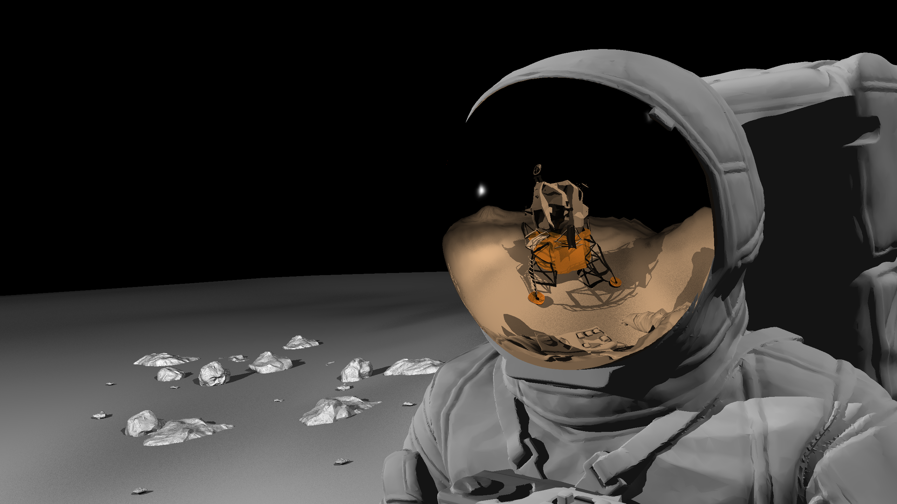

# Ray tracing project

This project is based on the ray tracing assignment of CSC418.

To reproduce the image that I submitted, you have to use g++ 7.3.0. (It has some weird bugs on g++ 5.4.0 so it doesn’t run on well cdf. The implementation of depth of field and perlin noise generated textures depends on  std::mt19937. It can’t be run well on g++ 5.4.0. You can still generate a image without procedural color).

##### Speed performance

Using AABBTree to store triangle meshes. Now the hit test of a ray is much more efficient than before (brute force). Creating many threads to the color of one row of pixels (parallel programming).

##### New function added

Each triangle now contains its normal information (per corner normal). When a ray hits a triangle, instead of giving the face normal of that triangle, it returns the interpolated normal (using barycentric coordinate).

Implemented refraction and depth of field 	(Monte Carlo sampling).

Sample image:

#### Acknowledgement of assets on Internet

##### .obj files:

Lunar landing module: https://nasa3d.arc.nasa.gov/detail/lunarlandernofoil-c

Astronaut: https://www.thingiverse.com/thing:2382467

rocks: https://www.thingiverse.com/thing:3013912

readOBJ.h and its dependencies are from libigl in other assignments.
